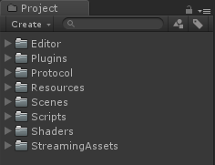

# ColaFrameWork  

### ColaFrameWork 自研Unity客户端框架  
架构阶段，暂时没有项目使用过。  

### 框架简介  

### 项目手册  

* 项目结构  
>   

* 游戏启动运行流程与机制  

> 待补充

* 数据节点管理   

> 策划使用Excel表进行数据的配置，然后通过[转表工具](https://github.com/XINCGer/Unity3DTraining/tree/master/XlsxTools/xls2csv)(位于ColaFrameWork\Tools\XlsxTools\xls2csv目录下，内有详细的使用指南)将Excel表转为csv结构的数据结构供客户端读取。  
每一份csv数据表，都应对应一个数据解析类以及一个数据集合类，其中数据解析类用于解析并存储csv中的单条数据（一行），数据集合类将存储多个数据解析类的对象。  
数据解析类都应继承自 **LocalDataBase** (本地数据表中的单条数据的抽象基类)：  
```C#
/// <summary>
/// 本地数据表中的单条数据的抽象基类
/// </summary>
public abstract class LocalDataBase
{
    /// <summary>
    /// ID
    /// </summary>
    public int id;

    /// <summary>
    /// 初始化数据
    /// </summary>
    /// <param name="strData"></param>
    public abstract void InitWithStr(string strData, char splitChar = ',');

    /// <summary>
    /// 得到Int数据
    /// </summary>
    /// <param name="str"></param>
    /// <returns></returns>
    protected int GetInt(string str)
    {
        if (!string.IsNullOrEmpty(str))
        {
            return int.Parse(str);
        }

        return 0;
    }

    /// <summary>
    /// 得到float数据
    /// </summary>
    /// <param name="str"></param>
    /// <returns></returns>
    protected float GetFloat(string str)
    {
        if (!string.IsNullOrEmpty(str))
        {
            return float.Parse(str);
        }

        return 0;
    }

    /// <summary>
    /// 得到bool数据
    /// </summary>
    /// <param name="str"></param>
    /// <returns></returns>
    protected bool GetBool(string str)
    {
        if (!string.IsNullOrEmpty(str))
        {
            return bool.Parse(str);
        }

        return false;
    }
}

```
**LocalDataBase** 该抽象类提供了一些基本的数据类型转换方法，id字段用来存储索引id，InitWithStr接口用来解析数据，将数据表中的单行文本传入到该接口以后，通过splitChar标识将数据进行拆分、解析。框架中已经包含了**I18NData**解析类，编写其他数据解析类时可以参考此类。

* 事件/消息处理中心(Controller层)    

> 待补充  

* UI框架(View层)   

> 待补充  

* SubSys系统框架(Module层)  

> 待补充  

* Execl策划表格规范与转表  

> 待补充  

* 资源管理  

> 待补充  

* 编辑器拓展与工具  
> 待补充  

* 游戏自动化测试  
> 框架中集成了WETEST_SDK，通过使用[GAutomator](https://github.com/Tencent/GAutomator)实现Unity手游的UI自动化测试。  

* DebugLog与日志  
> 待补充  


