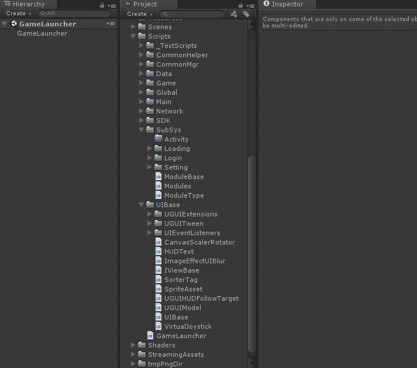
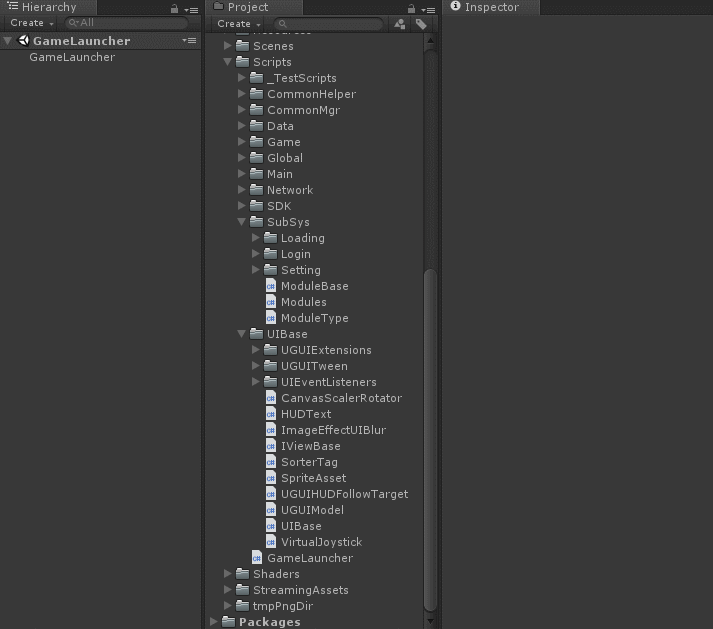
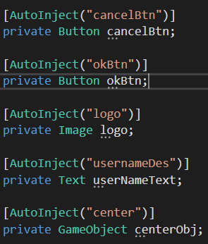
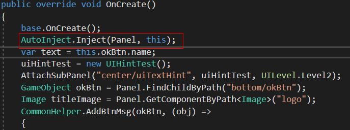

# ColaFrameWork  

### ColaFrameWork 自研Unity客户端框架  
架构阶段，暂时没有项目使用过。  

### 框架简介  
ColaFramework 一款简洁的MVC结构的Unity客户端框架，尤其支持快速开发3D战斗卡牌和mmo类型的游戏。目前已经接入了Tolua，进行Lua层的架构工作。暂时还不支持热更，下一步准备完善这方面的内容，希望有兴趣的可以一起来维护。  

### 开发计划  
马三把近一个月内要开发的任务都放在本项目的敏捷开发面板中了。可以直接按照下面的方式查看看板中的开发计划与进度。
  
### 开发环境  
* Unity2018.2.3  
* VS2017  
* C# & Lua    

### 安装集成  
可以选择以下安装方式集成本框架：
* Clone本项目到本地，与自己的代码融合或者直接在框架基础上进行开发  

### 项目手册  

#### 项目结构  
  

#### 游戏启动运行流程与机制  

目前框架根据平台的不同，设计了不同的启动场景，分别命名为：  
>* GameLauncher(Windows平台)  
>* GameLauncherAndroid(Android平台)  

无论启动场景是哪一个，游戏都由GameLauncher启动器脚本启动。GameLauncher为一个单例类，在游戏初始化的过程中，启动器类负责初始化GameManager、InputMgr、FpsHelper、DebuglogHelper、U3DAutomation、StreamingAssetHelper、多线程工具类等一些基础的操作。  
在一些必要的资源准备妥当以后，会执行InitGameCore()方法，该方法会调用GameManager的InitGameCore()方法，进一步地进行初始化一些次要的管理器与资源。
在GameLauncher类中，会主动调用GameManager的Update、LateUpdate、FixedUpdate、ApplicationQuit等类似于MonoBehaivor中的方法，这让您依然可以自由地在这些方法中进行处理自己的相应逻辑。  

  
  

#### 数据节点管理   

* CSV&C#版数据节点管理  
策划使用Excel表进行数据的配置，然后通过[转表工具](https://github.com/XINCGer/Unity3DTraining/tree/master/XlsxTools/xls2csv)(位于ColaFrameWork\Tools\XlsxTools\xls2csv目录下，内有详细的使用指南)将Excel表转为csv结构的数据结构供客户端读取。  
每一份csv数据表，都应对应一个数据解析类以及一个数据集合类，其中数据解析类用于解析并存储csv中的单条数据（一行），数据集合类将存储多个数据解析类的对象。  
数据解析类都应继承自 **LocalDataBase** (本地数据表中的单条数据的抽象基类)：  
```C#
/// <summary>
/// 本地数据表中的单条数据的抽象基类
/// </summary>
public abstract class LocalDataBase
{
    /// <summary>
    /// ID
    /// </summary>
    public int id;

    /// <summary>
    /// 初始化数据
    /// </summary>
    /// <param name="strData"></param>
    public abstract void InitWithStr(string strData, char splitChar = ',');

    /// <summary>
    /// 得到Int数据
    /// </summary>
    /// <param name="str"></param>
    /// <returns></returns>
    protected int GetInt(string str)
    {
        if (!string.IsNullOrEmpty(str))
        {
            return int.Parse(str);
        }

        return 0;
    }

    /// <summary>
    /// 得到float数据
    /// </summary>
    /// <param name="str"></param>
    /// <returns></returns>
    protected float GetFloat(string str)
    {
        if (!string.IsNullOrEmpty(str))
        {
            return float.Parse(str);
        }

        return 0;
    }

    /// <summary>
    /// 得到bool数据
    /// </summary>
    /// <param name="str"></param>
    /// <returns></returns>
    protected bool GetBool(string str)
    {
        if (!string.IsNullOrEmpty(str))
        {
            return bool.Parse(str);
        }

        return false;
    }
}

```
**LocalDataBase** 该抽象类提供了一些基本的数据类型转换方法，id字段用来存储索引id，InitWithStr接口用来解析数据，将数据表中的单行文本传入到该接口以后，通过splitChar标识将数据进行拆分、解析。框架中已经包含了**I18NData**解析类，编写其他数据解析类时可以参考此类。  
数据集合类都应实现 **ILocalDataMapBase** 接口(DataMap，数据集合的接口，实现该接口用于管理LocalDataBase)  
```C#
/// <summary>
/// DataMap，数据集合的接口，实现该接口用于管理LocalDataBase
/// </summary>
public interface ILocalDataMapBase
{
    /// <summary>
    /// 对多行字符串进行处理，保存成LocalDataBase集合
    /// </summary>
    /// <param name="rows"></param>
    void SetMapCsv(string[] rows);
}
```  
**ILocalDataMapBase** 接口内只有一个 **void SetMapCsv(string[] rows)** 抽象方法，该方法用来对多行字符串进行处理，保存成LocalDataBase集合。
框架中已经包含了**I18NDataMap**数据集合类，编写其他数据集合类时可以参考此类。  

* LuaConfig&Lua版数据结构管理  

同样本框架也支持将Excel表格数据转为lua形式的配置文件，这样便于接入Lua开发以后数据的访问，提高访问效率。  
Lua格式的转表工具位于[Lua转表工具](./Tools/XlsxTools/xls2lua),其中config配置文件用来配置原始数据的目录和导出的Lua配置文件的目录
如果没有特殊需求的话，无需变更配置文件，直接执行同级目录下的Xls2Lua.exe工具即可进行转表操作。  
可以通过 configMgr:GetConfig(name) 方法获取到对应表格的全部配置数据。通过ConfigMgr:GetItem(name,id)可以获取到对应表格的指定id的数据，ConfigMgr在数据加载与读取过程中做了懒加载的缓存策略，在尽可能节省空间的情况下提高数据加载与读取的速度。  
#### 事件/消息处理中心(Controller层)    
框架支持C#版和Lua版两套消息监听与派发机制，用来充当普通的Controller层，用于V和M的解耦等操作。具体的实现原理和用法可以看以下这篇博客：  
[【Unity游戏开发】用C#和Lua实现Unity中的事件分发机制EventDispatcher](https://www.cnblogs.com/msxh/p/9539231.html)  

#### UI框架(View层)   
* UI工作流程  
  
* UI主要方法  
  
#### 在ColaFramework框架中通过编辑器提高UI开发效率  
ColaFrameWork框架在UI开发方面提供了编辑器拓展。通过编辑器可以快速通过模版创建新的UIView类、Module类。也可以新建新的UI模版，支持C#和Lua模板。   
  
  

#### SubSys系统框架(Module层)  
Module的基类为ModuleBase，游戏内所有的系统的业务逻辑层均继承自该类。框架采用厚Module类型的MVC结构，弱化了C层的作用，强化了M层。游戏中的业务逻辑大部分都放在M层进行处理处理。M层负责处理业务逻辑、监听网络消息、请求网络消息、派发事件通知其他模块或者UI等更新。M层不应该了解View层的存在，不可以直接调用View层，应该通过消息机制通知View做出动作。

#### 组件与实体获取  
ColaFrameWork框架中支持两种种获取组件或者Gameobject等其他实体的方式，分别为传统直接获取式、AutoInject依赖注入式两种，下面详细介绍一下区别与使用：  
>* 传统直接获取式:函数接口位于CommonHelper通用助手类下面,以下方法均为拓展方法形式，方便调用,具体为：  
```C# 
T GetComponentByName<T>(this GameObject go, string name) 
T[] GetComponentsByName<T>(this GameObject go)   
GameObject GetGameObjectByName(this GameObject go, string childName) 
List<GameObject> GetGameObjectsByName(this GameObject go, string childName) 
GameObject FindChildByPath(this GameObject obj, string childPath) 
T GetComponentByPath<T>(this GameObject obj, string childPath) 
```    

>* AutoInject依赖注入式:通过给需要注入的字段或者属性打上AutoInjectAttribute标签，然后再调用AutoInject.Inject(Panel, this);方法，底层会在内部通过反射
机制完成对应字段或属性的注入，然后直接即可像正常的Component或者Gameobject等实体来使用了。具体使用方法如下所示:  
   

* TODO:Lua端的获取组件的方法  
#### Execl策划表格规范与转表  
  
如上图所示，在ColaFramework框架中，规定Excel表格的前四行为固定形式。第一行为说明，解释每一项的意义。第二行为所填数据类型，比如int,string等。第三行为索引字段，表示我们在代码里面如何读取该字段内容。第四行为备用行，可以依据自己的需要进行制定。
除了以上四行以外，其他的行我们就可以填写自己的数据配置了。  
ColaFramework框架配置了两款转表工具，分别为xls2csv和xls2lua，顾名思义分别是把Excel表格配置转换为csv和lua形式的数据文件。  
**xls2csv**  
本工具支持将xls xlsx 格式的文件转换为csv  
需要安装xlrd模块：   
* 首先到：https://pypi.python.org/pypi/xlrd 下载xlrd源码包  
* 在解压后的源码包内执行 python setup.py install  
* 重启命令行即可生效  
使用方法：
* 打开 config.ini 配置文件，配置输入路径以及输出路径  
* 执行 xlsx2csv.py 脚本进行自动导表  
教程地址  
* [点我点我](http://www.cnblogs.com/msxh/p/7858346.html)  

---  
**Xls2lua**  
Xls转lua小工具
本工具支持将xls 格式的文件转换为lua，并且配有简单的ConfigMgr读取类  
目录结构    
* Excel目录存放的是用于测试的文件，表格规定前4行为一些说明与配置信息，不可为空，必填项；  
* ConfigMgr目录存放的是一个简单的读取转出的lua文件信息的类；  
* LuaData 存放的是转出来的Lua文件；  
* Xls2Lua目录包含的是转表工具的源代码；  
使用方法  
配置bin目录下的config.ini文件，指定Excel输入目录和Lua输出目录，然后执行编译出来的exe文件即可。  
教程地址  
[【游戏开发】Excel表格批量转换成lua的转表工具](https://www.cnblogs.com/msxh/p/8539108.html)  

#### 资源管理  

资源管理这部分准备用一套成熟的第三方框架代替自研。    

#### 资源引用查找与依赖关系分析插件  
简介  
本插件基于[blueberryzzz大佬](https://github.com/blueberryzzz) 的 [ReferenceFinder](https://github.com/blueberryzzz/ReferenceFinder)插件改造得来。感谢[blueberryzzz大佬](https://github.com/blueberryzzz)的无私分享！  
这是一个用来查找资源引用和依赖的插件，通过缓存来保存资源间的引用信息，通过树状结构直观的展示。  
由于是通过缓存进行实现的，所以在希望的到精确的引用信息时需要刷新缓存。不过由于缓存的存在，在资源改动较少的情况下，刷新速度较快，对使用影响较小。  
直接将文件夹拖到项目中即可使用。  
使用示例  
右键需要查找引用的文件或文件夹，点击Find References进行查找。  
  
**按钮含义：**  
Refresh Data:刷新缓存
Model:切换引用和依赖
NeedUpdateState:是否需要根据当前文件的状态更新State栏。  
Expand:展开列表
Collapse:折叠列表
  
  
第三列的State为Changed代表这个资源被修改了，Missing代表资源被删除了，No Data代表缓存中没有该资源的信息。  
实现方案  
**方案选择**  
1.在每次需要查找时进行一次全局查找，保证查找的正确性。但是进行全局查找会很慢，因为查找资源依赖信息的接口GetDependencies本质上其实是对文本的查找(比如prefab中会以文本的形式记录prefab所引用资源的guiid和fileid)，在不进行多线程查询优化的情况下这是一个很慢的过程，存储在机械硬盘上时会更慢。  
2.进行一次全局查找生成缓存，在进行查找时直接读取缓存（在资源改动时会出现引用信息不准确的问题），在资源变动时需要更新缓存，保持查找的正确性，不过由于缓存的存在，在资源没有太大的改动的情况下，刷新速度较快。
因此，这里选择了方案二。
查找及缓存  
**引用信息的生成:**  
通过AssetDatabase.GetAllAssetPaths()获取项目中所有的资源路径。  
通过AssetDatabase.GetDependencies()获取每一个资源所依赖资源的信息。  
经过这两步之后就有了所有资源的依赖信息了。  
通过资源的依赖信息，我们就可以生成所有资源的引用信息了。  
**缓存:**  
为了让缓存尽量的小，所以缓存只保存每个资源的guid、引用资源哈希值、依赖资源的信息。
其中引用资源哈希值时用于判断这个资源依赖的资源是否有修改，若有修改，则在刷新资源引用信息的时候需要重新读取这个资源的依赖信息，否则继续使用该信息。这个判断就是在资源改动较少时减少刷新时间的关键。  
在记录依赖时，没有直接记录依赖资源的guid，而是记录了资源在缓存中下标的位置，从而进一步缩小缓存的大小。  
界面实现  
主要使用了Unity自带的TreeView实现树形界面的展示。  
#### 编辑器拓展与工具  
待补充  

#### 游戏自动化测试  
框架中集成了WETEST_SDK，通过使用[GAutomator](https://github.com/Tencent/GAutomator)实现Unity手游的UI自动化测试。  
TODO:对网易的自动化测试解决方案做一些调研[传送门](http://airtest.netease.com/index.html)  

#### DebugLog与日志  
出于方便定位错误和使结构尽量清晰的目的，ColaFramework框架并没有像其他框架一样对控制台打印进行过度封装。用户依然使用Unity原生自带的Debug.log等函数进行控制台打印，只不过ColaFramework框架对Log输出进行了统一地控制，可以统一地开启或者关闭Log输出。通过宏 **BUILD_DEBUG_LOG** 可以统一控制Log是否被打印到控制台。同时ColaFramework框架也支持将日志实时地记录到设备本地，方便移动平台进行查错等工作。通过宏 **OUTPUT_LOG** 可以控制日志是否被记录到设备本地。日志通常被保存在对应平台的可读写路径下的logs目录下的gamelog.txt中。  

#### 网络通信与协议  
待补充  

#### 寻路系统  
ColaFramework框架目前集成了AStar、Recast两种寻路系统。  

#### 插值动画/缓动动画  
ColaFramework框架集成了DoTween、iTween两款比较常见的插值动画/缓动动画插件，并且自己拓展封装了适合UGUI的UGUITween组件，可以像NGUI中的Tween一样使用，非常方便，用来解决一些简单的Tween动画效果再合适不过了。  
其中拓展UGUITween组件包含以下几个常用的Tween组件：  
>* UGUITweenScale  
>* UGUITweenPosition  
>* UGUITweenAlpha  
>* UGUITweenRotation  


