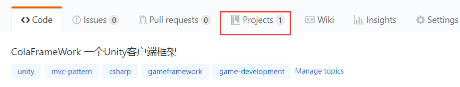
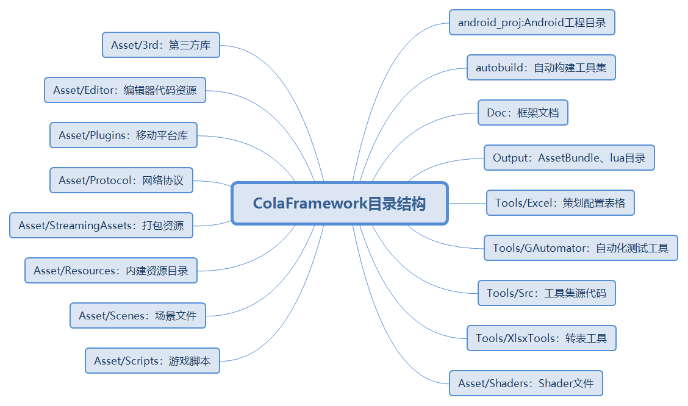
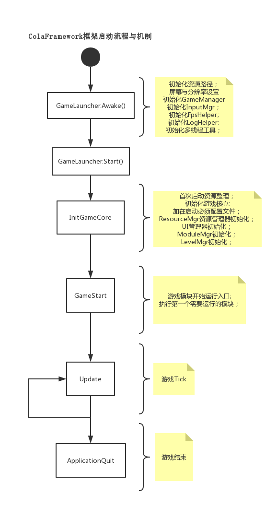
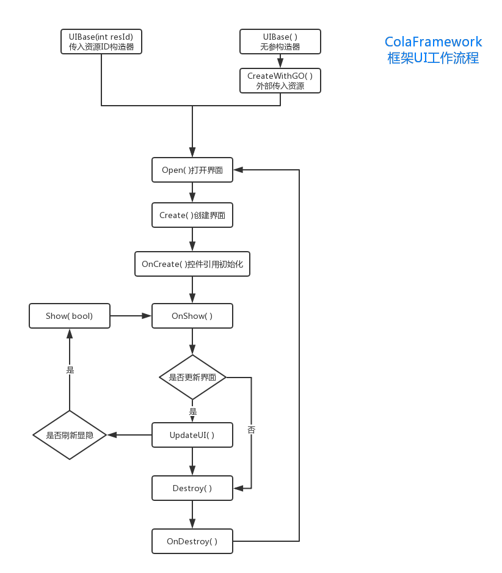
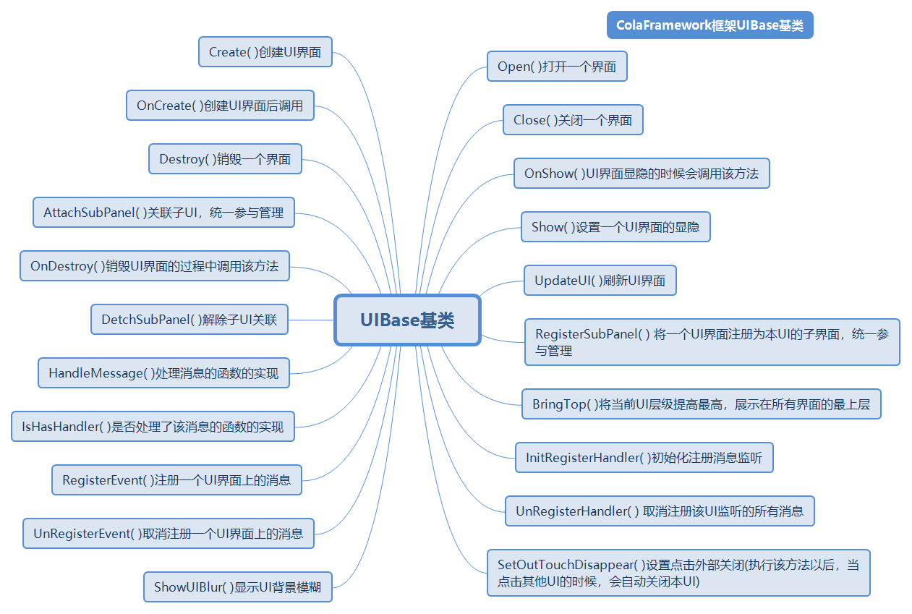

# ColaFrameWork  

### ColaFrameWork 自研测试性Unity客户端框架  

### 框架简介  
ColaFramework 一款简洁的MVC架构的测试性Unity客户端框架。目前已经接入了Tolua，进行Lua层的开发工作。暂时还不支持热更，下一步准备完善这方面的内容。    
### 开发计划  
马三把近一个月内要开发的任务都放在本项目的敏捷开发面板中了。可以直接按照下面的方式查看看板中的开发计划与进度。
  
### 开发环境  
* Unity2018.2.3  
* VS2017  
* C# & Lua    

### 安装集成  
可以选择以下安装方式集成本框架：
* Clone本项目到本地，与自己的代码融合或者直接在框架基础上进行开发  

### 项目手册  

#### 项目结构  
  

#### 游戏启动运行流程与机制  

目前框架根据平台的不同，设计了不同的启动场景，分别命名为：  
>* GameLauncher(Windows平台)  
>* GameLauncherAndroid(Android平台)  

无论启动场景是哪一个，游戏都由GameLauncher启动器脚本启动。GameLauncher为一个单例类，在游戏初始化的过程中，启动器类负责初始化GameManager、InputMgr、FpsHelper、DebuglogHelper、U3DAutomation、StreamingAssetHelper、多线程工具类等一些基础的操作。  
在一些必要的资源准备妥当以后，会执行InitGameCore()方法，该方法会调用GameManager的InitGameCore()方法，进一步地进行初始化一些次要的管理器与资源。
在GameLauncher类中，会主动调用GameManager的Update、LateUpdate、FixedUpdate、ApplicationQuit等类似于MonoBehaivor中的方法，这让您依然可以自由地在这些方法中进行处理自己的相应逻辑。  

  
  

#### 数据配置表管理   
ColaFramework框架提供了CSV版本和原生lua版本的数据配置表管理，可以根据自己的实际需要进行选择。  
详情请见[数据配置表管理Wiki页面](https://github.com/XINCGer/ColaFrameWork/wiki/%E6%95%B0%E6%8D%AE%E9%85%8D%E7%BD%AE%E8%A1%A8%E7%AE%A1%E7%90%86)  

#### 事件/消息处理中心(Controller层)    
框架支持C#版和Lua版两套消息监听与派发机制，用来充当普通的Controller层，用于V和M的解耦等操作。具体的实现原理和用法可以看以下这篇博客：  
[【Unity游戏开发】用C#和Lua实现Unity中的事件分发机制EventDispatcher](https://www.cnblogs.com/msxh/p/9539231.html)  

#### UI框架(View层)   
* UI工作流程  
  
* UI主要方法  
  
#### 在ColaFramework框架中通过编辑器提高UI开发效率  
ColaFrameWork框架在UI开发方面提供了编辑器拓展。通过编辑器可以快速通过模版创建新的UIView类、Module类。也可以新建新的UI模版，支持C#和Lua模板。   
详见[Wiki页面](https://github.com/XINCGer/ColaFrameWork/wiki/%E5%9C%A8ColaFramework%E6%A1%86%E6%9E%B6%E4%B8%AD%E9%80%9A%E8%BF%87%E7%BC%96%E8%BE%91%E5%99%A8%E6%8F%90%E9%AB%98UI%E5%BC%80%E5%8F%91%E6%95%88%E7%8E%87)  

#### SubSys系统框架(Module层)  
Module的基类为ModuleBase，游戏内所有的系统的业务逻辑层均继承自该类。框架采用厚Module类型的MVC结构，弱化了C层的作用，强化了M层。游戏中的业务逻辑大部分都放在M层进行处理处理。M层负责处理业务逻辑、监听网络消息、请求网络消息、派发事件通知其他模块或者UI等更新。M层不应该了解View层的存在，不可以直接调用View层，应该通过消息机制通知View做出动作。

#### 组件与实体获取  
分别支持C#端的和lua端的组件获取，详见[组件与实体获取wiki页面](https://github.com/XINCGer/ColaFrameWork/wiki/%E7%BB%84%E4%BB%B6%E4%B8%8E%E5%AE%9E%E4%BD%93%E8%8E%B7%E5%8F%96)  
#### Execl策划表格规范与转表  
本框架支持将Excel表格转为csv和lua原生格式的配置数据文件，详见[Execl策划表格规范与转表Wiki页面](https://github.com/XINCGer/ColaFrameWork/wiki/Execl%E7%AD%96%E5%88%92%E8%A1%A8%E6%A0%BC%E8%A7%84%E8%8C%83%E4%B8%8E%E8%BD%AC%E8%A1%A8)  

#### 资源管理  

资源管理这部分准备用一套成熟的第三方框架代替自研。    

#### 资源引用查找与依赖关系分析插件  
简介  
本插件基于[blueberryzzz大佬](https://github.com/blueberryzzz) 的 [ReferenceFinder](https://github.com/blueberryzzz/ReferenceFinder)插件改造得来。感谢[blueberryzzz大佬](https://github.com/blueberryzzz)的无私分享！  
这是一个用来查找资源引用和依赖的插件，通过缓存来保存资源间的引用信息，通过树状结构直观的展示。  
由于是通过缓存进行实现的，所以在希望的到精确的引用信息时需要刷新缓存。不过由于缓存的存在，在资源改动较少的情况下，刷新速度较快，对使用影响较小。  
直接将文件夹拖到项目中即可使用。  
详情请点击 [ReferenceFinder Wiki页面](https://github.com/XINCGer/ColaFrameWork/wiki/%E8%B5%84%E6%BA%90%E5%BC%95%E7%94%A8%E6%9F%A5%E6%89%BE%E4%B8%8E%E4%BE%9D%E8%B5%96%E5%85%B3%E7%B3%BB%E5%88%86%E6%9E%90%E6%8F%92%E4%BB%B6)  
#### 编辑器拓展与工具  
待补充  

#### 游戏自动化测试  
框架中集成了WETEST_SDK，通过使用[GAutomator](https://github.com/Tencent/GAutomator)实现Unity手游的UI自动化测试。  
TODO:对网易的自动化测试解决方案做一些调研[传送门](http://airtest.netease.com/index.html)  

#### DebugLog与日志  
ColaFramework中的Debuglog与日志相关内容请查看[Debuglog与日志Wiki页面](https://github.com/XINCGer/ColaFrameWork/wiki/DebugLog%E4%B8%8E%E6%97%A5%E5%BF%97)  

#### 网络通信与协议  
待补充  

#### 寻路系统  
ColaFramework框架目前集成了AStar、Recast两种寻路系统。  

#### 插值动画/缓动动画  
ColaFramework框架集成了DoTween、iTween两款比较常见的插值动画/缓动动画插件，并且自己拓展封装了适合UGUI的UGUITween组件，可以像NGUI中的Tween一样使用，非常方便，用来解决一些简单的Tween动画效果再合适不过了。  
其中拓展UGUITween组件包含以下几个常用的Tween组件：  
>* UGUITweenScale  
>* UGUITweenPosition  
>* UGUITweenAlpha  
>* UGUITweenRotation  

#### 联系方式  
* QQ群：421527940  
  

